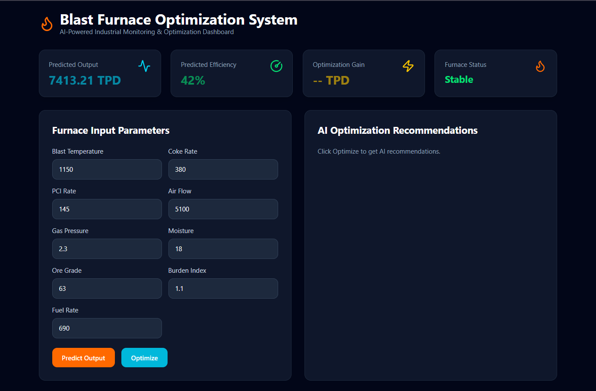
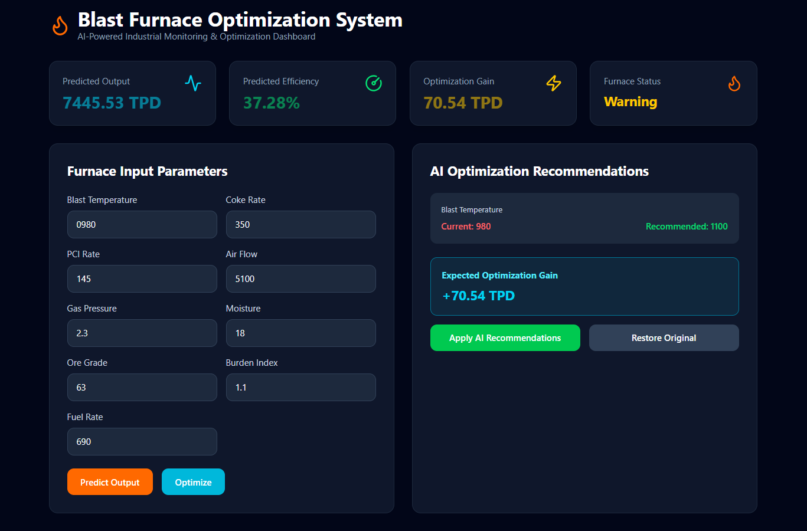
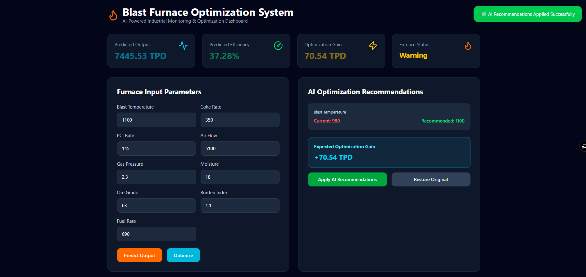
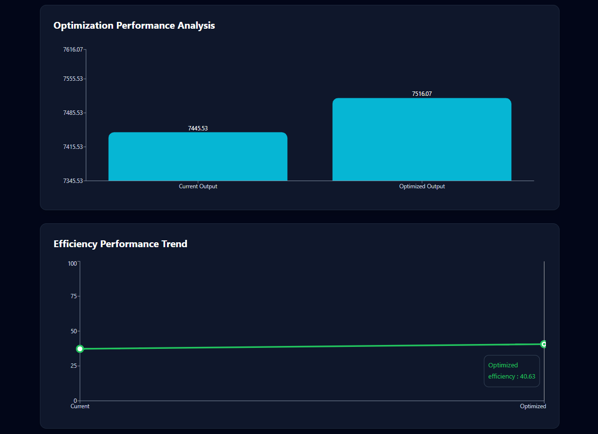

# 🔥 Blast Furnace Optimization System

AI-powered industrial optimization dashboard that predicts blast furnace output, monitors operational efficiency, and generates intelligent optimization recommendations using machine learning.

### 🌐 Live Demo
**Frontend:** https://blast-furnace-optimization.vercel.app  
**Backend API:** https://blast-furnace-backend.onrender.com

> **Note:** Backend is hosted on Render free tier, so the first request may take a few seconds if the service is waking up.

---

## Overview

Blast furnace operations rely on precise control of multiple process parameters such as blast temperature, coke rate, PCI injection, airflow, gas pressure, moisture, and ore quality.

This project simulates an industrial AI decision-support system that helps operators optimize furnace performance through real-time prediction and intelligent recommendations.

---

## Dashboard Workflow

The dashboard follows a practical industrial optimization pipeline:

### 1. Enter Current Furnace Parameters
Provide real operational values such as:

- Blast Temperature
- Coke Rate
- PCI Rate
- Air Flow
- Gas Pressure
- Moisture
- Ore Grade
- Burden Index
- Fuel Rate

---

### 2. Predict Current Performance
The AI engine predicts:

- **Hot Metal Output (TPD)**
- **Operational Efficiency (%)**
- **Dynamic Furnace Health Status**

---

### 3. Run AI Optimization
The optimization engine evaluates improved operating conditions to maximize output while maintaining efficient performance.

---

### 4. Review AI Recommendations
The dashboard displays:

- Current vs recommended operating values
- Expected optimization gain
- Improved efficiency trends

---

### 5. Apply & Compare
Users can instantly apply recommendations and compare:

- Current output vs optimized output
- Efficiency improvement trend
- Furnace operational state

---

## Features

✅ ML-based hot metal output prediction  
✅ ML-based efficiency prediction  
✅ AI optimization recommendation engine  
✅ Dynamic furnace health monitoring  
✅ Interactive industrial dashboard  
✅ Output comparison bar chart  
✅ Efficiency trend visualization  
✅ Apply / Restore recommendation workflow  
✅ Real-time toast notifications  
✅ Fully deployed full-stack application  

---

## Tech Stack

### Frontend
- React.js
- Vite
- Tailwind CSS
- Axios
- Recharts
- Lucide React

### Backend
- Node.js
- Express.js
- Python

### Machine Learning
- Scikit-learn
- Pandas
- Joblib

### Deployment
- Vercel (Frontend)
- Render (Backend)

---

## Project Architecture

```bash
React Dashboard
      ↓
Node / Express API
      ↓
Python Prediction Engine
      ↓
Scikit-learn ML Models
```

---

## Screenshots

### Dashboard Home


---

### AI Optimization Recommendations


---

### Applied AI Recommendations


---

### Performance Analytics


---

## Future Improvements

- FastAPI / Flask backend for improved memory efficiency
- Advanced optimization algorithms
- PDF performance report generation
- Live industrial monitoring simulation
- Authentication & user session support

---

## Author

**Ashish Kumar**